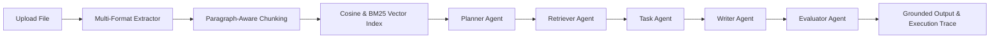

# NeuroFlow AI — Agentic Document Intelligence Workspace

[](https://opensource.org/licenses/MIT)
[]()
[-10b981.svg)]()

**NeuroFlow AI** is a production-grade, full-stack MERN application built in pure JavaScript (ES6+) that transforms multi-format documents (PDF, DOCX, TXT, MD, CSV, Images with OCR) into searchable, vector-indexed workspaces. It orchestrates a **5-stage agentic workflow pipeline** (Planner ➔ Retriever ➔ Task ➔ Writer ➔ Evaluator) with verifiable citations and 100% offline fallback capabilities.

---

## ⚡ Key Highlights & Architecture



- **MERN + Pure JavaScript**: High-performance Express backend with dual-mode repository (MongoDB Atlas/Local + Automatic In-Memory fallback).
- **Free & Local AI Stack**: Native integration with local **Ollama** (`llama3.2:1b` / `llama3.1:8b` for chat reasoning and `nomic-embed-text` for chunk embeddings).
- **Deterministic Offline Fallbacks**: Workflows execute seamlessly even when Ollama is offline or MongoDB is down.
- **5 Autonomous Agent Workflows**:
  1. **Ask Workspace**: Citation-grounded interactive Q&A chat with multi-thread management.
  2. **Summarize Workspace**: Executive summary with numbered key takeaways.
  3. **Compare Documents**: Cross-document differential and structural analysis (2+ docs).
  4. **Meeting Notes ➔ Action Items**: Automated extraction of tasks, owners, priority tracks, and deadlines.
  5. **Research Brief**: Comprehensive thematic briefing with section headings and strategic conclusions.
- **Visual Workflow Graph**: Dynamic 5-stage node graph reflecting real-time workspace document readiness and execution trace state.
- **Deep Execution Traces**: Stage-by-stage timings, input payloads, intermediate reasoning, and Evaluator confidence scores.
- **Theme Switcher**: Crisp modern light studio theme (daytime SaaS) + modern elevated slate dark mode with instant 1-click toggle and persistence.

---

## 🚀 Quick Start Guide

### 1. Prerequisites
- **Node.js**: v18.0.0 or higher
- **Ollama** (Optional for local AI): Download from [ollama.com](https://ollama.com)
  ```bash
  ollama pull llama3.2:1b
  ollama pull nomic-embed-text
  ```

### 2. Backend Setup (`server/`)
```bash
cd server
npm install
npm start
```
*Backend runs on `http://localhost:3001` (API Base: `http://localhost:3001/api`).*

### 3. Frontend Setup (`client/`)
```bash
cd client
npm install
npm run dev
```
*Frontend runs on `http://localhost:5173`.*

---

## 🔑 Demo Credentials (Pre-seeded)

Use the built-in **"Quick Demo Login"** button on the login screen or enter:
- **Email**: `demo@neuroflow.ai`
- **Password**: `Password@123`

Pre-loaded with sample workspaces:
- *Autonomous AI Agent Frameworks* (Technical whitepapers & benchmarks)
- *Executive Product Planning & Q3 Roadmap* (Meeting transcripts & action deliverables)

---

## ⚙️ Environment Configuration (`.env`)

| Variable | Description | Default |
| :--- | :--- | :--- |
| `PORT` | Express server port | `3001` |
| `MONGODB_URI` | MongoDB Connection URI | `mongodb://localhost:27017/neuroflow-ai` |
| `JWT_SECRET` | Secret key for JWT signing | `neuroflow_jwt_secret_production_key_2026` |
| `OLLAMA_BASE_URL` | Local Ollama instance URL | `http://127.0.0.1:11434` |
| `OLLAMA_CHAT_MODEL` | Ollama model for chat & agents | `llama3.2:1b` |
| `OLLAMA_EMBED_MODEL` | Ollama model for embeddings | `nomic-embed-text` |

---

## 🛡️ Supported Ingestion Formats

- **PDF**: Extracted via `pdf-parse`
- **DOCX**: Extracted via `mammoth`
- **CSV**: Structured parse via `csv-parse`
- **Images (PNG, JPG, JPEG, WEBP)**: Extracted via `tesseract.js` OCR
- **Plain Text & Markdown**: Direct paragraph-aware text chunking (~1,200 chars, 200 char overlap)

---

## 🧪 Verification & Testing

Run the automated full-stack verification suite:
```bash
node server/scripts/verify-all.js
node server/scripts/test-all-workflows.js
```
Validate frontend build:
```bash
cd client && npm run build
```

---

## 📄 License
MIT License. Created for Agentic Document Intelligence Workflows.
