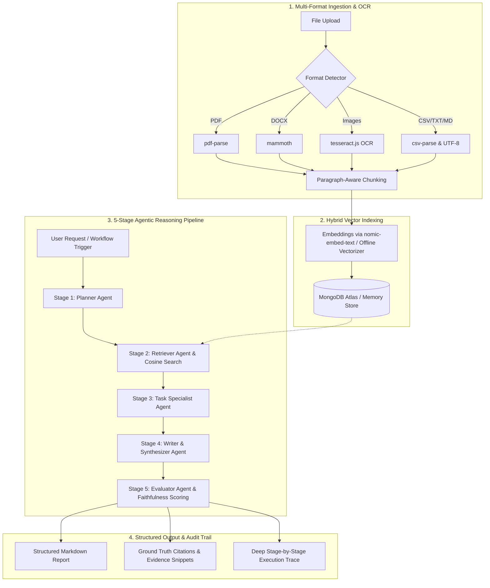

# 🧠 NeuroFlow AI — Agentic Document Intelligence Workspace

[](https://opensource.org/licenses/MIT)
[]()
[](https://neuro-flow-ai-rho.vercel.app)
[-46e3b7?logo=render)](https://neuroflow-ai-4i2z.onrender.com/api/health)
[-10b981.svg)]()

> **NeuroFlow AI** is a production-grade, full-stack workspace intelligence platform built with pure JavaScript (ES6+). It transforms multi-format documents into searchable vector-indexed knowledge bases and orchestrates a **5-stage autonomous agent pipeline** (*Planner ➔ Retriever ➔ Task Specialist ➔ Synthesizer ➔ Evaluator*) with verifiable paragraph-level citations and resilient offline fallback execution.

---

## 🌐 Live Deployments & Demo

| Service | Environment | Live URL | Status |
| :--- | :--- | :--- | :--- |
| **Web Application** | Vercel Edge CDN | [https://neuro-flow-ai-rho.vercel.app](https://neuro-flow-ai-rho.vercel.app) | 🟢 Active |
| **Backend API** | Render Cloud Web Service | [https://neuroflow-ai-4i2z.onrender.com/api](https://neuroflow-ai-4i2z.onrender.com/api) | 🟢 Healthy |
| **Health Check** | Real-time Telemetry | [https://neuroflow-ai-4i2z.onrender.com/api/health](https://neuroflow-ai-4i2z.onrender.com/api/health) | 🟢 200 OK |
| **Source Code** | GitHub Repository | [https://github.com/manikanta-2310/NeuroFlow-AI](https://github.com/manikanta-2310/NeuroFlow-AI) | 🟢 `main` |

### 🔑 Quick Demo Credentials (Pre-seeded in Cloud DB)
Use the one-click **"Quick Demo Login"** on the landing page or authenticate with:
- **Email**: `demo@neuroflow.ai`
- **Password**: `Password@123`

---

## ⚡ Core Architecture & Pipeline



---

## 🚀 Key Features

### 1. 🤖 5 Autonomous Agentic Workflows
- **Ask Workspace (Chat / Q&A)**: Interactive conversational intelligence grounded with numbered inline citations.
- **Document Summarization**: Structured executive summaries with metadata, TL;DR, and thematic breakdowns.
- **Meeting Notes ➔ Action Items**: Extracts task owners, priority badges (`Critical`, `High`, `Medium`, `Low`), deadlines, and original context snippets.
- **Research Brief**: Synthesizes complex documents into structured briefs covering background, core findings, methodologies, and risks.
- **Document Comparison**: Cross-document comparative analysis identifying key commonalities, architectural differences, and semantic contradictions.

### 2. 📊 Dynamic Visual Workflow Graph & Execution Traces
- **Real-Time Visual Graph**: Interactive 5-stage node graph reflecting workspace readiness, active stages, and pipeline progress.
- **Deep Execution Traces**: Stage-by-stage timings, input payloads, intermediate reasoning tokens, and Evaluator confidence scores (0–100%).

### 3. 🎨 Elevated Dual-Theme System
- **Studio Daylight Mode**: Modern SaaS aesthetics (`#f8fafc` backdrop, pure white cards, crisp `#0f172a` text, and vibrant indigo accents).
- **Elevated Slate Dark Mode**: High-contrast dark theme (`#0b0f19` canvas, `#111827` elevated surfaces, refined slate borders).
- **Instant Persistence**: Smooth 1-click theme toggle stored in `localStorage`.

### 4. 🛡️ Resilient Dual-Mode Repository & Hybrid AI Engine
- **Dual-Mode Repository**: Connects to MongoDB Atlas when configured, with automatic seamless fallback to an In-Memory store.
- **Hybrid AI Engine**: Integrates natively with local Ollama (`llama3.2:1b`, `llama3.1:8b`, `nomic-embed-text`) with a deterministic offline semantic fallback engine.

---

## 🛠️ Technology Stack

| Layer | Technologies |
| :--- | :--- |
| **Frontend** | React 18, Vite 5, Tailwind CSS, Lucide Icons, Framer Motion, TanStack Query, React Router v6, Zustand |
| **Backend** | Node.js (v20 LTS), Express 4, JWT Authentication, Multer, Node-Cron |
| **Document Processing** | `pdf-parse`, `mammoth` (DOCX), `tesseract.js` (OCR), `csv-parse`, `sharp` |
| **Database & Cache** | MongoDB Atlas, Mongoose 8, In-Memory Store Fallback, Upstash Redis support |
| **AI & Embeddings** | Ollama API (`llama3.2:1b`, `nomic-embed-text`), Cosine Similarity Search, BM25 Tokenizer, Deterministic Fallback Engine |
| **Hosting & CI/CD** | Vercel (Edge CDN Frontend), Render (Cloud Web Service Backend), GitHub Actions compatible |

---

## 📡 REST API Reference

| Method | Endpoint | Description | Auth Required |
| :--- | :--- | :--- | :---: |
| `GET` | `/api/health` | Service health, DB mode & AI engine telemetry | No |
| `POST` | `/api/auth/register` | Register new user account | No |
| `POST` | `/api/auth/login` | Authenticate user & receive JWT token | No |
| `GET` | `/api/auth/me` | Fetch active user profile & preferences | Yes |
| `GET` | `/api/dashboard/stats` | Retrieve workspace count, doc count, chunk stats | Yes |
| `GET` | `/api/workspaces` | List all user workspaces | Yes |
| `POST` | `/api/workspaces` | Create new isolated workspace domain | Yes |
| `GET` | `/api/workspaces/:id` | Get workspace details, documents, and runs | Yes |
| `POST` | `/api/workspaces/:id/documents/upload` | Upload & extract multi-format documents (PDF, DOCX, IMG, CSV) | Yes |
| `POST` | `/api/workspaces/:id/chat` | Send conversational query with citation retrieval | Yes |
| `POST` | `/api/workspaces/:id/runs/summarize` | Execute 5-stage Document Summarization workflow | Yes |
| `POST` | `/api/workspaces/:id/runs/action-items` | Execute 5-stage Meeting Action Items workflow | Yes |
| `POST` | `/api/workspaces/:id/runs/research-brief` | Execute 5-stage Research Brief workflow | Yes |
| `POST` | `/api/workspaces/:id/runs/compare-docs` | Execute 5-stage Document Comparison workflow | Yes |
| `GET` | `/api/runs/:runId` | Retrieve full stage-by-stage execution trace | Yes |

---

## 💻 Local Development Setup

### 1. Clone Repository
```bash
git clone https://github.com/manikanta-2310/NeuroFlow-AI.git
cd NeuroFlow-AI
```

### 2. Configure Environment (`.env`)
Create a `.env` file in the project root (see `.env.example`):
```env
PORT=3001
CLIENT_URL=http://localhost:5173
MONGODB_URI=mongodb+srv://<user>:<password>@cluster0.mongodb.net/neuroflow-ai
JWT_SECRET=neuroflow_super_secret_jwt_key_2026
OLLAMA_BASE_URL=http://localhost:11434
OLLAMA_CHAT_MODEL=llama3.2:1b
OLLAMA_EMBED_MODEL=nomic-embed-text
SEED_SAMPLE_DATA=true
```

### 3. Start Backend Server
```bash
cd server
npm install
npm start
```
*Backend runs on `http://localhost:3001` (API Base: `http://localhost:3001/api`).*

### 4. Start Frontend Client
```bash
cd ../client
npm install
npm run dev
```
*Frontend runs on `http://localhost:5173`.*

---

## 🧪 Verification & Automated Tests

Verify backend endpoints, OCR extraction, and all 5 agentic workflows:
```bash
# Test all 5 workflow pipelines & live execution traces
node server/scripts/test-all-workflows.js

# Test end-to-end API routes, authentication & document ingestion
node server/scripts/verify-all.js

# Test client production build
cd client && npm run build
```

---

## 📄 License
Released under the [MIT License](LICENSE). Built for Autonomous Document Intelligence & Multi-Stage Agentic Reasoning.
